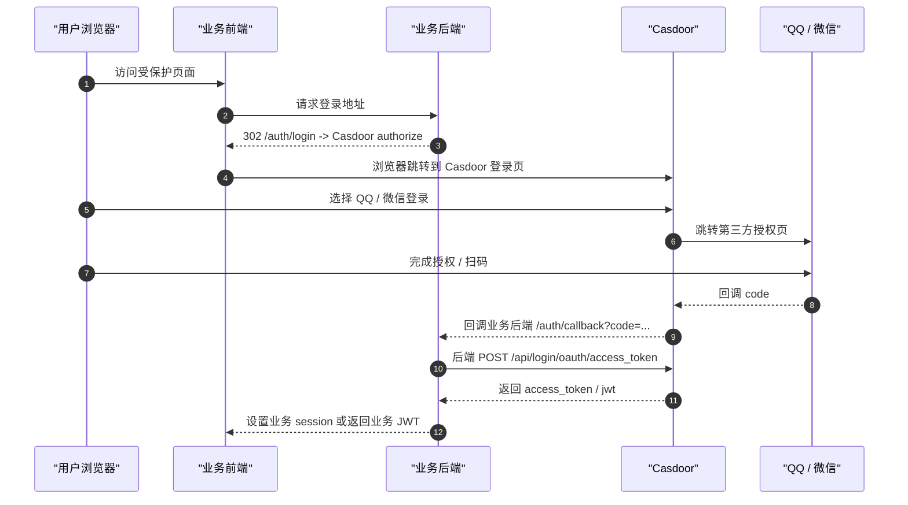
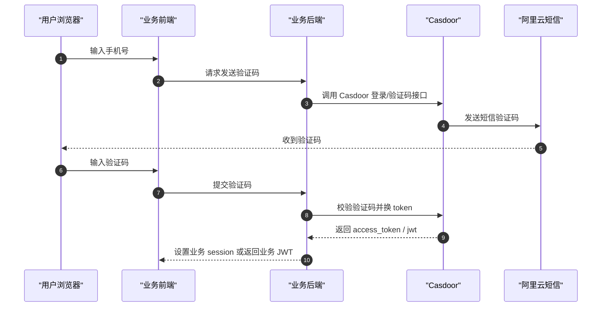
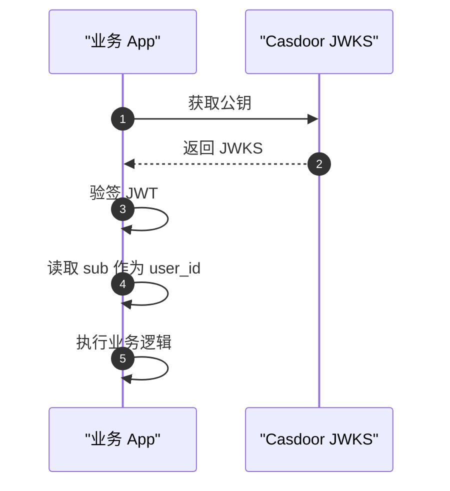

# Casdoor 接入时序图

## 1. 浏览器登录

## 2. 短信验证码登录

## 3. 业务侧验 JWT

## 4. 关键说明

- `登录页跳转` 是浏览器前向重定向，不是纯服务端 API 调用
- `token 交换 / userinfo / jwks` 才是后端 API 调用
- `QQ / 微信` 只会被 Casdoor 直接对接，业务 App 不直接接它们
- `阿里云短信` 也是 Casdoor 内部的发送通道，业务 App 不直接发短信
