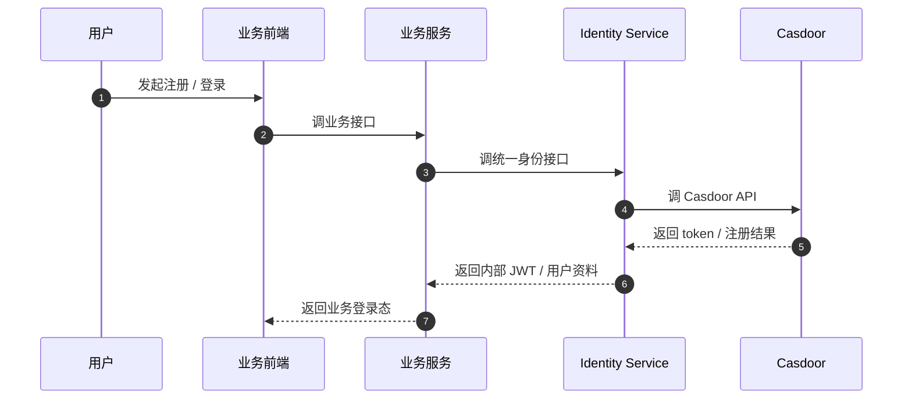
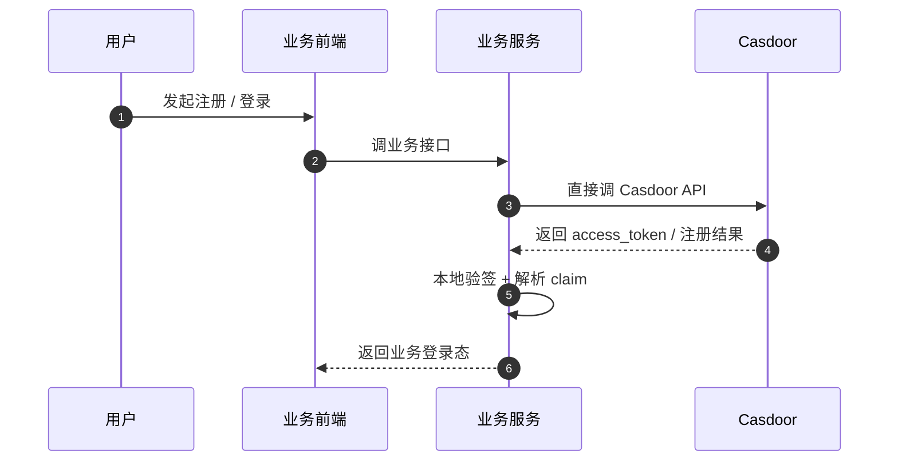

# 业务服务对接 Casdoor 接口流程文档

## 1. 文档目的

这份文档回答三个核心问题：

- 业务服务后续应该如何接入 Casdoor
- 用户注册应该由业务服务调用谁来完成
- 业务服务拿到 `access_token` 后应该如何解析和判断

本文档给出两种模式：

- 推荐模式：业务产品统一对接 `Identity Service`，由 `Identity Service` 再对接 Casdoor
- 过渡模式：业务后端暂时直接调用 Casdoor API

默认推荐长期采用第一种模式。

## 2. 结论

### 2.1 长期推荐方案

长期建议统一采用下面这条链路：

`业务前端 / 业务服务 -> Identity Service -> Casdoor`

原因是：

- Casdoor 更适合作为统一认证入口，而不是所有业务系统直接依赖的用户中心
- 公司唯一用户、账号绑定、权限口径、内部会话，应该沉淀在 `Identity Service`
- 后续如果接支付、渠道、集团用户、内部权限体系，继续通过 `Identity Service` 扩展更稳定

这也符合当前仓库里的架构约定：

- Casdoor 负责外部认证入口
- `identity.xx.cn` 作为公司唯一身份中心
- 各业务产品只对接 `identity.xx.cn`

## 2.2 过渡方案

如果 `Identity Service` 还没有建设完整，业务后端可以先直接调用 Casdoor 完成：

- 短信验证码发送
- 用户注册
- 登录换 token
- JWT 验签

但这只是过渡方案，不建议让所有业务长期直接依赖 Casdoor。

## 3. 角色分工

### 3.1 Casdoor 负责什么

Casdoor 负责：

- 上游认证入口
- 第三方登录接入
- 短信 / 邮箱验证码能力
- OIDC / OAuth2 token 签发
- `userinfo` 与 `JWKS` 提供

### 3.2 Identity Service 负责什么

Identity Service 负责：

- 对接 Casdoor OIDC
- 维护公司唯一用户
- 维护第三方账号绑定
- 管理统一会话
- 对业务服务签发内部 `Identity JWT`
- 提供统一的 `me`、权限、租户、渠道信息

### 3.3 业务服务负责什么

业务服务负责：

- 调用 `Identity Service` 的统一身份接口
- 按照业务场景发起注册、登录、登出
- 在自身服务侧校验收到的 JWT
- 根据 `sub`、租户、渠道、权限 claim 执行业务逻辑

## 4. 推荐接入模式

### 4.1 总体链路

```text
业务前端
   -> 业务服务
   -> Identity Service
   -> Casdoor
```

其中：

- 浏览器重定向、登录跳转由前端配合后端完成
- token 交换、验证码发送、注册提交由后端调用
- 业务服务优先信任 `Identity Service` 发出的内部 JWT

### 4.2 推荐原则

- Web / H5 登录优先走标准 OIDC 重定向流程
- App / 小程序可以由客户端拿第三方 `code`，再交给后端换 token
- 手机号 / 邮箱注册由业务服务调用 `Identity Service`，再由后者调用 Casdoor
- 业务微服务之间尽量不直接消费 Casdoor token，而消费 `Identity Service` 的内部 token

## 5. 业务服务应该调用哪些接口

下面是推荐给业务服务暴露的一组统一接口。

这些接口由 `Identity Service` 提供，不要求每个业务服务直接暴露给外部用户，但业务系统应统一依赖这一层。

### 5.1 登录入口

`GET /auth/login`

用途：

- 让业务前端拿到登录跳转地址
- 由 `Identity Service` 组装 Casdoor 授权参数

建议参数：

- `clientId`
- `redirectUri`
- `scope`
- `state`
- `nonce`
- `responseType=code`

业务含义：

- 业务系统不自己拼 Casdoor 登录 URL
- 统一通过 `Identity Service` 跳转

### 5.2 登录回调

`GET /auth/callback`

用途：

- 接收 Casdoor 回调的 `code`
- 服务端调用 Casdoor `POST /api/login/oauth/access_token`
- 换取 `access_token` / `id_token`
- 创建或绑定内部用户
- 签发内部会话或内部 JWT

### 5.3 发送注册验证码

`POST /auth/register/send-code`

用途：

- 业务侧发起短信或邮箱验证码发送
- `Identity Service` 转调 Casdoor `POST /api/send-verification-code`

建议请求体：

```json
{
  "applicationId": "admin/app-abc-portal",
  "type": "phone",
  "dest": "13800138000",
  "countryCode": "CN",
  "method": "signup",
  "captchaType": "none",
  "captchaToken": "",
  "clientSecret": ""
}
```

### 5.4 注册

`POST /auth/register`

用途：

- 业务侧提交注册信息
- `Identity Service` 转调 Casdoor `POST /api/signup`
- 注册成功后创建或补齐内部用户映射

建议请求体：

```json
{
  "application": "app-abc-portal",
  "organization": "A",
  "username": "alice",
  "password": "******",
  "name": "Alice",
  "phone": "13800138000",
  "phoneCode": "123456",
  "countryCode": "CN"
}
```

### 5.5 验证码登录

`POST /auth/login/code`

用途：

- 手机号 / 邮箱验证码登录
- `Identity Service` 转调 Casdoor `POST /api/login`
- 拿到 Casdoor token 后换成内部会话或内部 JWT

建议请求体：

```json
{
  "application": "app-abc-portal",
  "organization": "A",
  "username": "13800138000",
  "code": "123456",
  "signinMethod": "Verification code"
}
```

### 5.6 用户资料

`GET /me`

用途：

- 返回当前登录用户的统一身份资料
- 建议由 `Identity Service` 聚合内部用户表、租户、渠道、绑定关系后返回

### 5.7 用户权限

`GET /me/permissions`

用途：

- 返回当前用户可访问的权限、角色、渠道、租户信息

### 5.8 登出

`POST /auth/logout`

用途：

- 清理业务侧会话
- 按需清理 Identity Service 会话
- 按需触发 Casdoor 登出

## 6. Identity Service 如何调用 Casdoor

这一节说明 `Identity Service` 到 Casdoor 的下游调用关系。

### 6.1 注册验证码发送

Identity Service 调用：

- `POST /api/send-verification-code`

关键字段来自 `VerificationForm`：

- `applicationId`
- `type`
- `dest`
- `countryCode`
- `method`
- `captchaType`
- `captchaToken`
- `clientSecret`

### 6.2 注册

Identity Service 调用：

- `POST /api/signup`

关键字段来自 `AuthForm`：

- `application`
- `organization`
- `username`
- `password`
- `name`
- `email`
- `phone`
- `emailCode`
- `phoneCode`
- `countryCode`
- `affiliation`
- `region`

### 6.3 标准 OIDC 登录换 token

Identity Service 调用：

- `POST /api/login/oauth/access_token`

当前实现支持通过 query 参数或 JSON body 传参。

建议参数：

- `grant_type=authorization_code`
- `client_id`
- `client_secret`
- `code`
- `code_verifier`，如果启用了 PKCE

示例：

```json
{
  "client_id": "abc-client-id",
  "client_secret": "abc-client-secret",
  "grant_type": "authorization_code",
  "code": "returned-by-casdoor",
  "code_verifier": "pkce-verifier"
}
```

### 6.4 验证码登录

Identity Service 调用：

- `POST /api/login`

关键字段来自 `AuthForm`：

- `application`
- `organization`
- `username`
- `code`
- `signinMethod`

### 6.5 辅助接口

Casdoor 的辅助接口还包括：

- `GET /.well-known/openid-configuration`
- `GET /.well-known/:application/openid-configuration`
- `GET /.well-known/jwks`
- `GET /.well-known/:application/jwks`
- `GET /api/userinfo`
- `POST /api/login/oauth/refresh_token`
- `POST /api/login/oauth/introspect`

建议用途：

- `openid-configuration`：自动发现 issuer、token endpoint、jwks endpoint
- `jwks`：本地验签
- `userinfo`：补充资料，不作为主校验链路
- `refresh_token`：刷新登录态
- `introspect`：只在必要时用于远端探活或排错，不作为高频链路

## 7. access_token 怎么解析和判断

### 7.1 长期推荐判断对象

如果 `Identity Service` 已经建好，业务服务优先校验：

- `Identity Service` 发出的内部 JWT

而不是让每个业务服务都直接去理解 Casdoor token。

原因是：

- 内部权限口径更统一
- 后续权限、渠道、租户扩展更容易
- 更容易做业务级风控、封禁、租户隔离

### 7.2 过渡期怎么判断 Casdoor token

如果当前业务服务还直接拿 Casdoor 的 `access_token`，建议按下面步骤判断：

1. 从 Casdoor `JWKS` 拉取公钥并做缓存。
2. 根据 `kid` 选择正确公钥。
3. 校验签名算法与签名结果。
4. 校验标准时间 claim：
   - `exp`
   - `iat`
   - `nbf`
5. 校验 `iss` 是否等于你预期的 Casdoor issuer。
6. 校验 `aud` 或 `azp` 是否匹配当前业务应用。
7. 读取 `sub` 作为用户主键。
8. 读取业务所需扩展 claim，例如：
   - `scope`
   - `rootOrganization`
   - `channel`
   - `channelMode`
   - `provider`
9. 再根据本地业务表判断：
   - 用户是否已封禁
   - 用户是否有访问当前体系 / 当前渠道的权限

### 7.3 最小校验清单

业务服务最少应校验以下内容：

| 校验项 | 是否必须 | 说明 |
| --- | --- | --- |
| JWT 签名 | 必须 | 通过 `JWKS` 本地验签 |
| `exp` | 必须 | 是否过期 |
| `iss` | 必须 | 是否来自正确的 Casdoor / Identity Service |
| `aud` 或 `azp` | 必须 | 是否发给当前应用 |
| `sub` | 必须 | 用户唯一标识 |
| `scope` | 推荐 | 是否具备当前接口需要的 scope |
| `rootOrganization` | 推荐 | 是否属于当前公司边界 |
| `channel` / `channelMode` | 按需 | 是否属于当前渠道场景 |

### 7.4 不推荐的做法

不推荐每个请求都：

- 调 `userinfo`
- 调 `introspect`
- 依赖前端传来的用户资料做身份判断

推荐做法是：

- 本地验签
- 本地解析 claim
- 必要时再查本地业务库或统一身份库

### 7.5 当前仓库里的 claim 结构

当前 Casdoor token 中，除了标准 OIDC 字段外，还已经支持一些业务扩展 claim，例如：

- `scope`
- `channel`
- `rootOrganization`
- `channelMode`
- `azp`
- `provider`

因此业务服务完全可以在本地验签成功后，根据这些 claim 决定：

- 当前用户属于哪个公司
- 当前用户是不是渠道登录
- 当前用户是共享账号渠道还是独立子租户渠道

## 8. 两种推荐落地方式

### 8.1 方式 A：标准推荐方式



适用场景：

- 多产品、多公司、多渠道长期演进
- 需要统一用户中心
- 需要统一权限和租户边界

### 8.2 方式 B：过渡直连方式



适用场景：

- 当前还没有独立 Identity Service
- 只想先快速接通注册、登录、短信能力
- 后续准备再收口到统一身份层

## 9. 注册与登录的推荐实现顺序

建议按下面顺序落地：

1. 先确定业务系统长期是信任 Casdoor token，还是信任内部 Identity JWT。
2. 优先建设 `Identity Service` 的统一接口层。
3. 先打通 `GET /auth/login` + `GET /auth/callback`。
4. 再打通 `POST /auth/register/send-code` + `POST /auth/register`。
5. 再补 `GET /me`、`GET /me/permissions`。
6. 最后补刷新 token、登出、账号绑定、渠道/租户增强逻辑。

## 10. 最终建议

最终建议可以概括成三句话：

- 注册、登录、验证码这些能力，长期都应该由业务服务去调 `Identity Service`，再由 `Identity Service` 调 Casdoor。
- 如果当前还没有 `Identity Service`，业务后端可以先直接调 Casdoor，但要把这条链路视为过渡方案。
- `access_token` 不要靠 `userinfo` 做主判断，应该通过 `JWKS` 本地验签，再用 `sub`、`iss`、`aud`、`azp`、`rootOrganization`、`channelMode` 等 claim 做业务判断。

这样做的结果是：

- 业务接入路径统一
- 用户口径统一
- 渠道 / 租户 / 公司边界统一
- 后续从单产品扩展到多体系、多公司时不会失控
