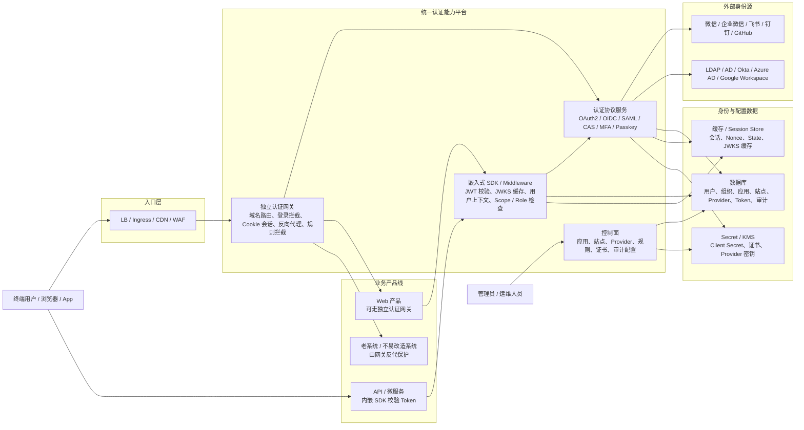

# 一套认证能力的企业级架构设计

## 1. 设计结论

这套认证能力不建议只设计成“独立认证网关”或“纯 SDK”其中一种形态。企业级生产里更常见、更稳的方式是：

> 中心化认证网关 + 业务服务内嵌轻量 SDK / Middleware。

独立认证网关负责统一登录、协议适配、MFA、Cookie 会话、域名路由、反向代理、规则拦截和审计。SDK / Middleware 负责在业务服务内部验证 token、解析用户上下文、做 Scope / Role 检查和少量权限钩子。

这样同一套认证能力既可以独立部署，也可以嵌入到产品线或微服务中。

## 2. 总体架构图



## 3. 三种部署形态

### 3.1 独立认证网关模式

适合 Web 产品、老系统、无法深度改造登录逻辑的系统。

典型链路：

```text
User -> LB / Ingress -> Auth Gateway -> Product Web / Legacy System
```

核心职责：

- 根据域名匹配站点配置
- 未登录时跳转统一登录
- 登录完成后写安全 Cookie
- 校验会话或 access token
- 通过后反向代理到业务系统
- 记录访问、认证、拦截和异常日志

这种模式的优点是接入成本低，业务系统可以少改甚至不改。缺点是网关处于请求主链路上，需要重点做好高可用、性能、超时、灰度和故障隔离。

### 3.2 嵌入式 SDK / Middleware 模式

适合 API 服务、微服务、移动端后端、内部服务。

典型链路：

```text
Client -> Product API -> Auth SDK / Middleware -> Business Handler
```

核心职责：

- 校验 JWT / access token
- 拉取并缓存 JWKS
- 解析用户 ID、组织、租户、Scope、Role
- 给业务 handler 注入用户上下文
- 提供 `RequireLogin`、`RequireScope`、`RequireRole` 等中间件

SDK 不应该负责完整登录页、OAuth callback、全局 Cookie、用户主数据管理和反向代理。它只消费统一认证平台签发的身份结果。

### 3.3 产品线内嵌服务模式

适合私有化部署、单产品一体化交付、轻量企业客户。

典型形态：

```text
Product Bundle
  - Product Web / API
  - Embedded Auth Service
  - Local Config / DB
```

这种模式下，认证能力可以作为产品的一部分交付，但内部仍应复用统一认证核心，避免每条产品线复制一套登录、MFA、Provider、Token 逻辑。

## 4. 企业级生产建议

### 4.1 推荐边界

认证平台应该负责：

- 登录协议适配
- 第三方身份源接入
- MFA / Passkey
- Token 签发与校验能力
- 网关级访问拦截
- 认证审计与安全策略

业务产品或 Identity Service 应该负责：

- 公司唯一用户主数据
- 产品级用户画像
- 产品级权限聚合
- 业务角色与业务资源关系
- 内部租户和业务域模型

一句话：认证平台解决“你是谁、是否登录、能否进入”，业务系统解决“你在这个业务里能做什么”。

### 4.2 生产部署要点

独立网关生产部署建议：

- 多副本无状态部署
- 前面挂 LB / Ingress / WAF
- TLS 证书统一托管和自动轮转
- Cookie 使用 `HttpOnly`、`Secure`、`SameSite`
- OAuth `state` 和 `nonce` 使用 signed state，或在更高安全要求场景下使用服务端会话 / 缓存绑定
- token 校验失败时清理会话并重新登录
- 对上游服务设置明确超时、重试和熔断策略
- 所有登录、回调、拒绝、代理异常进入审计日志

SDK 生产设计建议：

- 支持 JWKS 本地缓存和后台刷新
- 支持 token introspection 兜底
- 支持统一用户上下文结构
- 不强依赖网关在线才能处理本地 token 校验
- 权限失败返回标准 401 / 403
- 支持请求链路 trace id 透传

## 5. 对当前代码库的当前落地状态

当前代码库已经从 `Site` 反代认证网关雏形，推进到“现有 service 主链路 + 可复用 Gateway Core + Embedded SDK”的第一版结构。

### 5.1 Gateway Core

当前已新增 `gateway/core` 与 `gateway/config`：

- `gateway/config` 定义 `SiteAuthConfig`、`AuthConfig`、`UpstreamConfig` 和静态 resolver。
- `gateway/core` 定义 `Principal`、`AuthSession`、`AuthDecision`、`AuthError`、`TokenVerifier`。
- `gateway/core` 已实现 signed state codec 和 OAuth `BeginAuth` / `HandleCallback` 基础流程。
- `service/oauth.go` 的登录跳转已经复用 `gateway/core.OAuthFlow`，避免继续复制 state 生成逻辑。

尚未完成的是完整 `BuildPrincipal`、统一 `ClearSession` 抽象，以及把 `service/proxy.go` 的全部认证决策迁入 core。

### 5.2 Standalone Gateway

当前已新增 `gateway/standalone` 的身份头注入能力：

- 会覆盖客户端伪造的 `X-Auth-User`、`X-Auth-Owner`、`X-Auth-Email`、`X-Auth-Scope`、`X-Trace-Id`。
- 可基于 `core.Principal` 给后续上游请求注入标准身份头。

它目前还不是完整独立网关；HTTP/HTTPS 监听、TLS 证书加载、Host 路由、规则拦截和反向代理仍主要在 `service` 包内。

### 5.3 Embedded SDK

当前已新增 `sdk/httpauth`：

- `RequireLogin` 从 Bearer token 解析登录态，并通过 `core.TokenVerifier` 校验 token。
- `CurrentUser` 从 request context 获取 `core.Principal`。
- `RequireScope`、`RequireRole` 提供最小 Scope / Role 检查。
- SDK 不处理登录页、OAuth callback、全局 Cookie 和反向代理。

后续仍需要补 JWKS 缓存、introspection 兜底、错误响应模型配置和业务接入示例。

### 5.4 当前 service 主链路

现有 `service` 包仍是当前反代认证网关的运行主链路：

- `service/proxy.go` 负责 Host 路由、ACME / MP 校验、HTTPS 跳转、Inactive 拦截、OAuth 前置认证、规则判断和上游反代。
- `service/oauth.go` 负责 OAuth 登录跳转和 `/caswaf-handler` callback。
- `service/cookie.go` 负责认证 cookie 设置和清理。
- `service/gateway_metrics.go` 提供登录开始、callback 成功/失败、token invalid、inactive block、upstream error 的 Prometheus 指标。
- `service/oauth_state.go` 是 service 到 `gateway/core.StateCodec` 的兼容包装。

## 6. 后续如何更改

后续改造建议按“文档先行、核心抽取、模式拆分”的顺序推进。

### 6.1 文档维护方向

- 当前实现能力和风险边界更新到 [认证网关当前能力盘点](./auth-gateway-capabilities.md)。
- 目标架构、部署形态、模块边界更新到本文档。
- 如果新增 SDK 或独立部署方式，需要在本文档补充接入链路、职责边界和生产部署建议。
- 如果代码实现改变了认证流程，需要同步更新两个文档，避免“现状文档”和“目标架构”相互冲突。

### 6.2 代码更改方向

第一阶段先加固当前 `Site` 网关闭环：

- 修正 HTTPS callback URL 生成
- 增加 OAuth `state` / `nonce` 绑定校验
- 补齐 Cookie 安全属性
- token 解析失败时清 Cookie 并重新登录
- 增加 Inactive Site 拒绝策略

第二阶段抽出可复用认证核心：

- 把 OAuth 跳转、callback、token 校验、cookie/session、用户上下文生成从反代逻辑里拆出来
- 形成独立的 Gateway Core 包
- 独立网关和 SDK 都依赖 Gateway Core，而不是复制逻辑

第三阶段补齐两种运行形态：

- Standalone Gateway：继续承载域名路由、TLS、反代、规则、审计
- Embedded SDK：提供 Go middleware 和标准用户上下文 API

### 6.3 评审时重点看什么

1. 是否接受“中心化网关 + 嵌入式 SDK”的双形态。
2. 第一阶段是否优先解决 Web / 老系统接入，而不是先做完整 SDK。
3. 认证平台和 Identity Service 是否需要明确分层。
4. 当前 `service` 包是否应该拆出 Gateway Core。
5. P0 安全项是否应作为进入生产前的硬门槛。
