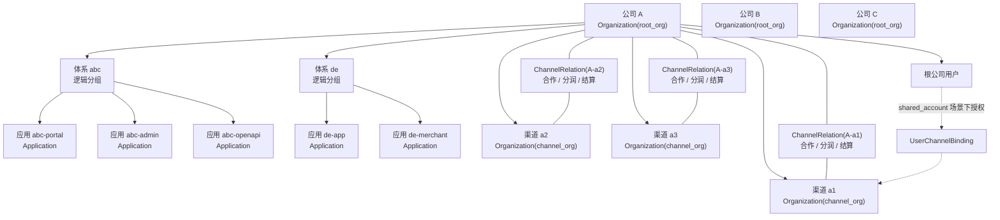

# 组织、体系、应用、渠道关系说明文档

## 1. 文档目的

这份文档用于厘清以下几类对象之间的关系，并约定它们在当前 Casdoor 模型中的落地方式：

- 公司
- 体系
- 应用
- 渠道 / 代理
- 分润 / 结算关系

本文档采用“业务关系模型 + Casdoor 落地映射”的方式说明，不引入新的数据库表，也不新增新的一等业务对象。

默认规则如下：

- 不同公司默认不互通用户。
- 同一公司内按“体系”互通用户。
- `a1/a2/a3` 这类渠道或代理按独立渠道组织建模，不按普通账号建模。
- `abc` / `de` 属于“体系”，每个体系下可包含多个 `Application`。

## 2. 核心概念

### 2.1 公司

公司是最上层业务主体，例如 `A`、`B`、`C` 三家公司。

在业务上，公司表示一个主租户，具备以下特征：

- 拥有自己的用户域边界。
- 拥有自己的应用集合。
- 可以发展自己的渠道或代理。
- 可以管理与下级渠道之间的合作和结算关系。

### 2.2 体系

体系是同一公司下共享用户域的一组业务应用，例如：

- `A` 公司下有 `abc` 体系
- `A` 公司下有 `de` 体系

体系本身不是当前 Casdoor 中的独立表对象，而是一个“逻辑分组”概念。

体系的关键语义是：

- 同一体系内的多个应用共享一套用户域。
- 不同体系之间默认不互通用户。
- 体系只是组织应用和定义互通边界的业务层概念。

### 2.3 应用

应用是体系中的具体产品、业务入口或客户端。

例如：

- `abc-portal`
- `abc-admin`
- `abc-openapi`
- `de-app`
- `de-merchant`

应用是当前 Casdoor 中的 `Application` 对象。

### 2.4 渠道 / 代理

渠道或代理是挂在某个公司下面的合作主体，例如 `A` 公司下面有：

- `a1`
- `a2`
- `a3`

这些对象不是普通用户账号，而是具备业务承接、合作关系、结算规则、权限隔离要求的主体，因此更适合建模为独立组织。

### 2.5 分润 / 结算关系

分润与结算关系用于表达：

- 渠道和上级公司之间的合作方式
- 分润比例
- 结算账户
- 生效状态

这部分不落在 `User` 或 `Application` 上，而是落在公司与渠道之间的关系对象上。

## 3. 主关系图

这张图表达的是四层关系：

`公司 -> 体系 -> 应用 -> 渠道/代理合作关系`

其中需要特别注意：

- 公司是顶层主体。
- 体系是逻辑分组，不是独立表。
- 应用是实际登录、接入、授权的对象。
- 渠道/代理是独立组织，不是普通用户。
- 共享账号渠道场景下，根公司用户与渠道之间还需要单独维护绑定关系。

## 4. 业务规则

### 4.1 用户互通规则

用户互通的主体是“同一公司下同一体系内的多个应用”。

默认规则如下：

- `A` 公司的 `abc` 体系内，多个应用之间用户互通。
- `A` 公司的 `de` 体系内，多个应用之间用户互通。
- `A` 公司的 `abc` 与 `de` 默认不互通。
- `A` 公司与 `B` 公司默认完全隔离。
- 如果未来需要集团级统一身份，需要额外设计，不在当前文档范围内。

也就是说，互通边界不按“整个公司全部互通”处理，而是按“体系”切分。

### 4.2 为什么渠道 / 代理不是普通账号

`a1/a2/a3` 这类对象不建议建成普通账号，原因是它们通常同时具备以下特征：

- 需要单独表达业务身份。
- 需要继承或隔离上级公司的数据访问能力。
- 需要配置合作模式。
- 需要配置分润比例和结算账户。
- 未来可能需要独立用户池或独立运营。

这些能力都更接近“组织”而不是“用户”。

### 4.3 共享账号与独立用户池

渠道通常有两种模式：

- `shared_account`
  - 渠道复用根公司用户池。
  - 用户主体仍然属于根公司。
  - 通过 `UserChannelBinding` 维护哪些根公司用户可以在哪些渠道下使用。

- `sub_tenant`
  - 渠道拥有独立用户池。
  - 渠道用户与根公司用户天然隔离。
  - 更适合强隔离经营、自主运营或独立结算场景。

## 5. Casdoor 落地映射

### 5.1 对象映射总表

| 业务概念 | Casdoor 对象 / 字段 | 说明 |
| --- | --- | --- |
| 公司 | `Organization` | 公司是主组织 |
| 公司类型 | `Organization.organizationType = root_org` | 表示根组织 |
| 渠道 / 代理 | `Organization` | 渠道也是组织 |
| 渠道类型 | `Organization.organizationType = channel_org` | 表示渠道组织 |
| 渠道归属 | `Organization.parentOrganization` | 指向上级公司 |
| 渠道模式 | `Organization.channelMode` | 取值为 `shared_account` 或 `sub_tenant` |
| 渠道结算开关 | `Organization.settlementEnabled` | 是否启用结算能力 |
| 渠道结算配置 | `Organization.settlementConfig` | 渠道侧补充结算配置 |
| 体系 | `Application.tags` 或统一命名约定 | 逻辑分组，不是独立实体 |
| 应用 | `Application` | 具体产品或入口 |
| 应用归属公司 | `Application.organization` | 应用挂在哪个公司下 |
| 公司与渠道关系 | `ChannelRelation` | 记录合作与分润关系 |
| 根公司用户与共享渠道的授权关系 | `UserChannelBinding` | 只适用于 `shared_account` |

### 5.2 公司如何映射

每个公司映射为一个根组织：

- `A -> Organization(name=A, organizationType=root_org)`
- `B -> Organization(name=B, organizationType=root_org)`
- `C -> Organization(name=C, organizationType=root_org)`

这意味着：

- `A/B/C` 的用户边界天然分开。
- 每个公司的应用统一挂在自己的 `organization` 下。
- 每个公司的渠道组织也统一挂在自己的 `parentOrganization` 下。

### 5.3 体系如何映射

体系不是当前 Casdoor 的独立对象，因此这里采用“轻量逻辑分组”方式承载。

推荐方式如下：

- 在 `Application.tags` 中标记体系，例如 `suite:abc`、`suite:de`
- 或采用统一命名规范，例如 `abc-portal`、`abc-admin`、`de-app`

推荐优先级：

1. 优先用 `Application.tags` 明确标记体系。
2. 命名规范作为辅助规则。

这里要强调：

- “体系”是业务约定，不是 Casdoor 内建能力。
- 文档中应将其视为逻辑分组，而不是新的数据库实体。

### 5.4 应用如何映射

每个具体应用映射为一个 `Application`，并通过 `Application.organization` 归属到对应公司。

例如：

| 应用名 | 所属公司 | 体系 |
| --- | --- | --- |
| `abc-portal` | `A` | `abc` |
| `abc-admin` | `A` | `abc` |
| `abc-openapi` | `A` | `abc` |
| `de-app` | `A` | `de` |
| `de-merchant` | `A` | `de` |

这里的“体系”信息不靠新增表保存，而是通过标签或命名约定识别。

### 5.5 渠道 / 代理如何映射

每个渠道或代理映射为一个渠道组织：

- `a1 -> Organization(name=a1, organizationType=channel_org, parentOrganization=A)`
- `a2 -> Organization(name=a2, organizationType=channel_org, parentOrganization=A)`
- `a3 -> Organization(name=a3, organizationType=channel_org, parentOrganization=A)`

然后再通过 `channelMode` 区分它是：

- `shared_account`
- `sub_tenant`

### 5.6 分润关系如何映射

分润和合作关系不建议混在组织基本信息里，而应维护在 `ChannelRelation` 中。

`ChannelRelation` 负责表达：

- `parentOrganization`
- `channelOrganization`
- `channelMode`
- `settlementRule`
- `settlementRatio`
- `settlementAccount`
- `status`

因此：

- “谁和谁合作”落在 `parentOrganization + channelOrganization`
- “合作模式是什么”落在 `channelMode`
- “怎么分润”落在 `settlementRule + settlementRatio`
- “钱结到哪里”落在 `settlementAccount`

### 5.7 共享账号渠道如何映射

当渠道复用根公司用户池时，仅有 `Organization(channel_org)` 还不够，还需要维护用户到渠道的授权关系。

这部分由 `UserChannelBinding` 承载，核心含义是：

- 某个根公司用户可以在哪个渠道下使用
- 该用户在渠道侧具备哪些角色
- 该用户在渠道侧具备哪些权限

也就是说：

- `shared_account` 模式下，需要 `ChannelRelation + UserChannelBinding`
- `sub_tenant` 模式下，一般不依赖 `UserChannelBinding`

## 6. 完整样例

下面用 `A` 公司举一个完整例子。

### 6.1 公司与体系

`A` 公司下面有两个体系：

- `abc`
- `de`

其中：

- `abc` 体系是一组共享用户域的应用
- `de` 体系是另一组共享用户域的应用
- `abc` 与 `de` 默认不互通

### 6.2 应用划分

`A` 公司的应用可以这样组织：

| 公司 | 体系 | Application | 用户是否互通 |
| --- | --- | --- | --- |
| A | abc | `abc-portal` | 与 `abc` 体系内应用互通 |
| A | abc | `abc-admin` | 与 `abc` 体系内应用互通 |
| A | abc | `abc-openapi` | 与 `abc` 体系内应用互通 |
| A | de | `de-app` | 与 `de` 体系内应用互通 |
| A | de | `de-merchant` | 与 `de` 体系内应用互通 |

互通边界结论：

- `abc-portal` 与 `abc-admin` 互通
- `abc-admin` 与 `abc-openapi` 互通
- `de-app` 与 `de-merchant` 互通
- `abc-portal` 与 `de-app` 默认不互通

### 6.3 渠道与代理

`A` 公司下面有三个渠道组织：

| 渠道 | organizationType | parentOrganization | channelMode | 说明 |
| --- | --- | --- | --- | --- |
| `a1` | `channel_org` | `A` | `shared_account` | 复用 A 的主用户池 |
| `a2` | `channel_org` | `A` | `sub_tenant` | 独立用户池 |
| `a3` | `channel_org` | `A` | `shared_account` | 复用 A 的主用户池 |

### 6.4 分润关系示例

| 上级公司 | 渠道 | 模式 | 分润规则 | 分润比例 | 结算账户 |
| --- | --- | --- | --- | --- | --- |
| `A` | `a1` | `shared_account` | 按订单实收分润 | `20%` | `acct-a1` |
| `A` | `a2` | `sub_tenant` | 按月度汇总结算 | `35%` | `acct-a2` |
| `A` | `a3` | `shared_account` | 按首单分润 | `15%` | `acct-a3` |

这三条关系建议分别落成三条 `ChannelRelation` 记录。

### 6.5 共享账号渠道的用户绑定示例

如果 `A` 公司下的用户 `u1` 可以在 `a1` 渠道侧操作，那么需要补充一条 `UserChannelBinding`：

| 字段 | 示例值 |
| --- | --- |
| `rootOrganization` | `A` |
| `user` | `u1` |
| `channelOrganization` | `a1` |
| `roles` | `["channel_operator"]` |
| `permissions` | `["order:read", "settlement:view"]` |

这表示：

- 用户本体仍属于 `A`
- 但该用户被授权在 `a1` 渠道侧使用
- 渠道侧权限由绑定关系单独定义

## 7. 落地建议

### 7.1 关于公司建模

- 每个公司单独建一个 `root_org`
- 不同公司不要共用用户域
- 不同公司下的应用统一挂在各自 `organization` 下

### 7.2 关于体系建模

- 当前阶段不要为“体系”新增数据库实体
- 先把体系视为应用层逻辑分组
- 推荐通过 `Application.tags` 维护体系标识
- 命名规范可作为补充，不建议只依赖命名

### 7.3 关于渠道建模

当渠道需要独立用户池时：

- 使用 `sub_tenant`

当渠道复用根公司用户池时：

- 使用 `shared_account`
- 同时维护 `UserChannelBinding`

简单判断原则：

- 如果渠道只是借用总部用户进行渠道运营，优先 `shared_account`
- 如果渠道需要独立注册、独立用户管理、独立运营边界，优先 `sub_tenant`

### 7.4 关于分润建模

- 合作关系和分润规则统一放在 `ChannelRelation`
- 不建议把分润比例散落在用户、角色或应用配置里
- `Organization.settlementEnabled` 和 `Organization.settlementConfig` 更适合作为组织侧补充配置
- 具体合作关系仍应以 `ChannelRelation` 为主

## 8. 常见问题

### 8.1 A / B / C 公司分别怎么建模？

分别建成三个根组织：

- `A -> root_org`
- `B -> root_org`
- `C -> root_org`

### 8.2 `abc` / `de` 体系和 `Application` 是什么关系？

`abc` / `de` 是应用的逻辑分组，不是独立实体。

一个体系下可以有多个 `Application`，这些应用共享同一套用户域边界。

### 8.3 哪些应用之间用户互通，哪些不互通？

- 同一公司、同一体系下的应用互通
- 同一公司、不同体系默认不互通
- 不同公司默认不互通

### 8.4 `a1/a2/a3` 为什么是组织，不是普通账号？

因为它们代表合作主体，不只是登录人，还要承载：

- 上下级关系
- 合作模式
- 分润规则
- 结算账户
- 隔离边界

所以应建模为组织。

### 8.5 共享账号渠道和子租户渠道分别什么时候用？

- 需要复用总部用户池时，用 `shared_account`
- 需要独立用户池时，用 `sub_tenant`

### 8.6 分润关系落在哪个对象里维护？

分润关系主要落在 `ChannelRelation` 中维护。

## 9. 最终结论

对于“公司 - 体系 - 应用 - 渠道 / 代理”的关系，推荐采用以下建模方式：

- 公司：`Organization(root_org)`
- 体系：`Application` 侧逻辑分组
- 应用：`Application`
- 渠道 / 代理：`Organization(channel_org)`
- 合作 / 分润关系：`ChannelRelation`
- 共享账号渠道的用户授权：`UserChannelBinding`

这套方式的优点是：

- 完全复用当前仓库已有对象
- 不需要新增 API 或数据表
- 能明确表达用户互通边界
- 能表达渠道层级与分润关系
- 能兼容共享账号与独立子租户两种渠道模式

因此，当前阶段最适合把“体系”定义为业务逻辑分组，把“渠道”定义为独立组织，并把合作关系与用户授权分别落在 `ChannelRelation` 和 `UserChannelBinding` 上。
